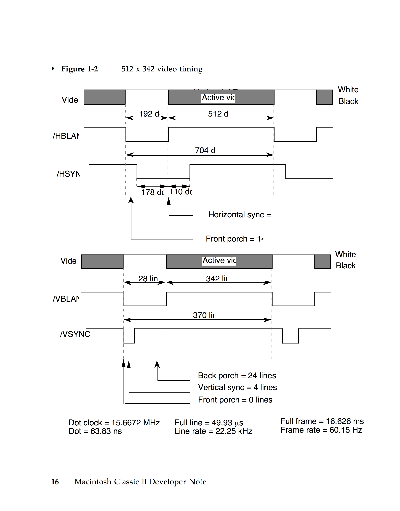
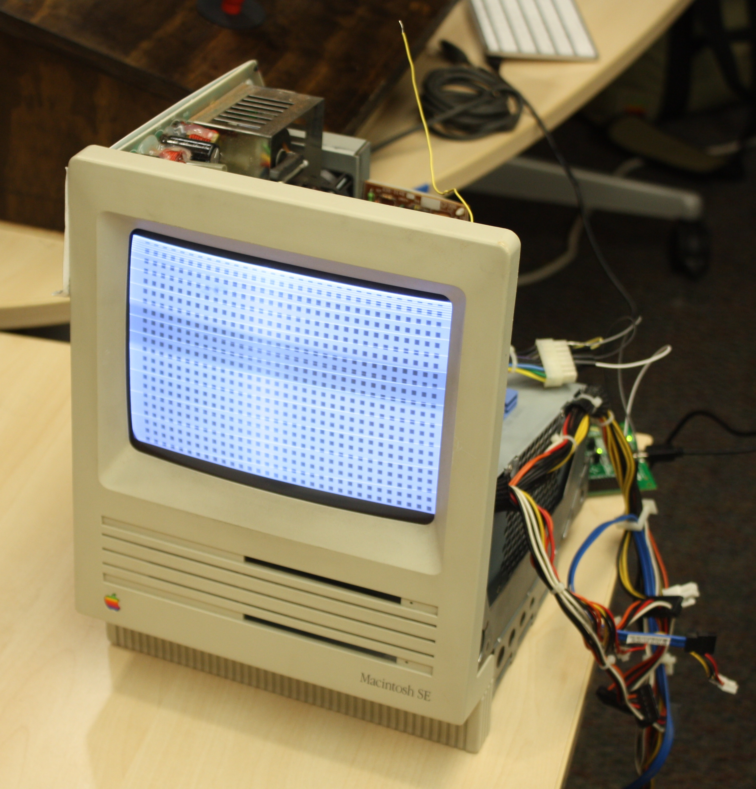

After confirming the Logic Board had some issues, I wanted to make sure the CRT screen didn't have any issues. Should I manage to have the logic board generate proper video signals in the future, I need to be sure that the CRT can display them in order to verify the logic board is behaving properly. Since verifying the CRT screen works is fairly simple (primarily due to the fact that the CRT screen can really only do two things), I decided to tackle that first. 

I chose to program to FPGA to first draw bars on the screen as a simple smoke test.

## Prerequisites 
 - [ghdl]
 - [GTKwave] 
 - [IceStorm]

## Implementation 
I wrote some VHDL to execute the behavior in the diagram to the right. It is important to note that the video signal is only allowed to be high in the "active video" portions of the signal.

I then wrote a test bench, simulated the design in GHDL, and began managing my code with git once I wrote enough. [Source Here]

Next, I had to configure the PLL to run at 15.667MHZ. I accomplished this by pushing the in clock to 141MHZ and using a clock divider synced at 9 cycles with a 44/55 duty cycle.

After multiple commits and revisions from my friend Michael, I synthesized the design and plugged in my FPGA to the Mac logic board connector using the reference card [here].

Nothing happened at first because I used resistors as voltage dividers to protect my FPGA from sourcing too much current. I pulled out the resistors(in retrospect, I should have simply used a multi-meter to measure the resistance offered by the CRT interface instead of taking my chances) and heard the CRT make an erratic ticking noise, suggesting it had trouble syncing. I noticed I had swapped my H_SYNC and V_SYNC by accident, so I reversed them and voila!

## Updates 
I later realized that the VHDL I wrote did not correctly follow the video protocol as described in the figure above, so I updated the code, pushed changes, and also modified the code to display square test patterns, which reasonably confirms to me that the screen works.

[ghdl]:http://ghdl.free.fr
[GTKwave]:https://sourceforge.net/projects/gtkwave/files/gtkwave-3.3.89-osx-app/
[IceStorm]:https://github.com/FPGAwars/toolchain-icestorm/wiki
[Source Here]:https://github.com/BracketMaster/MacSE_CRT_Controller_Test
[here]: power_pinout.png
