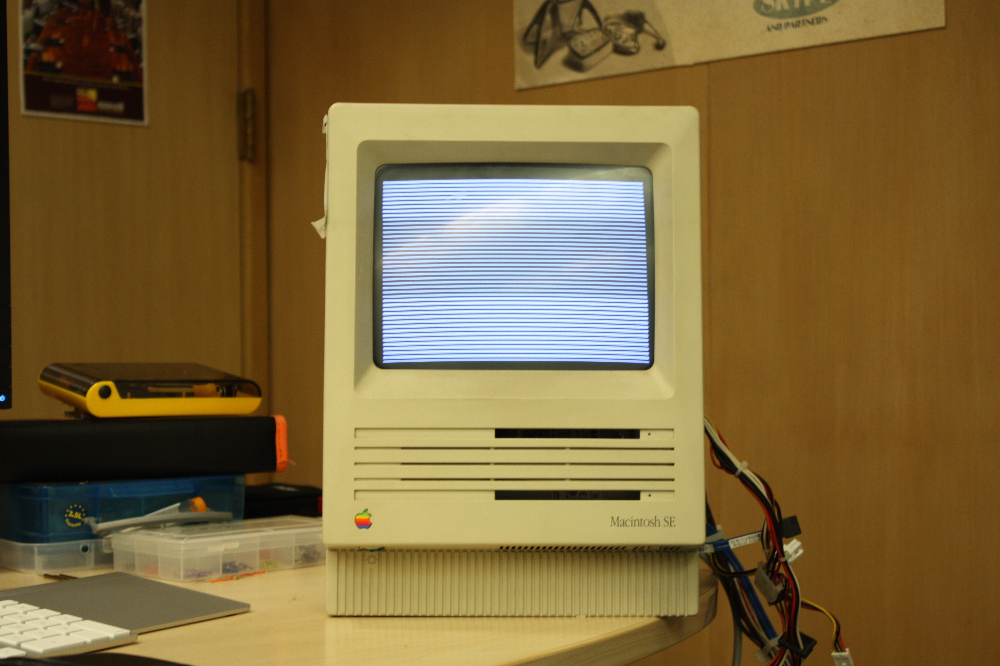
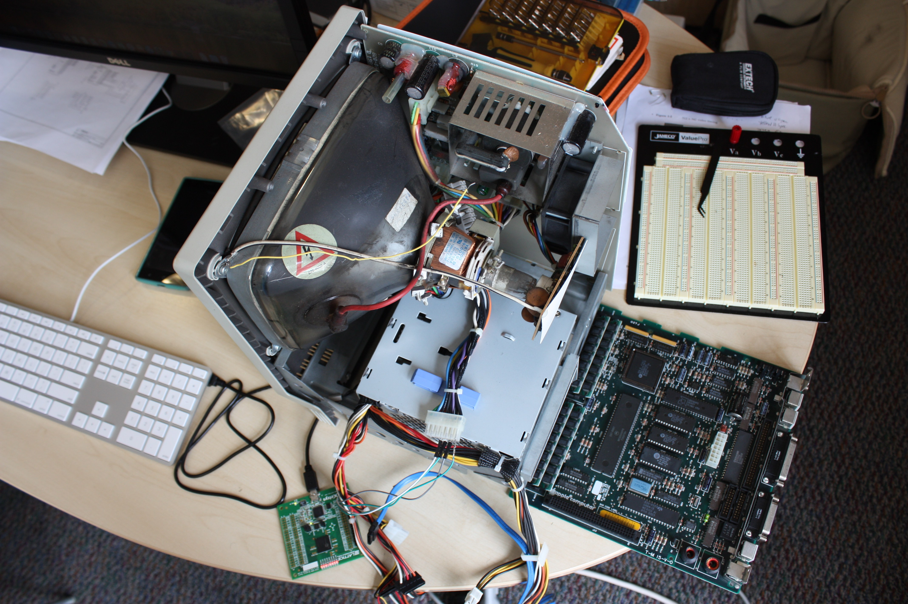

# First Steps 
The first thing I always do is power on the device.

I was greeted with this screen.

I wasn't quite sure what to do, so naturally I disassembled the machine and took a look inside.

The logic board looked surprisingly clean. Finding no obvious issues with the motherboard, I proceeded to find some documentation on the internals of the Macintosh SE. Below I list some documents which proved rather helpful.

 - Macintosh Family 2nd Edition May 1990
 - Motorola 68K Microprocessor Datasheet
 - [Macintosh SE Schematics and Pinout](http://www.ccadams.org/se/pinouts.html)
 - Macintosh Family Hardware Reference

With respect to the large body of knowledge that I gleaned from these resources, the following pieces of information largely determined my next steps.

 - The CRT will behave like a 100KV capacitor if improperly handled
 - The Macintosh SE has a Processor Direct Slot - The 1980s equivalent of a PCIE slot
 - The Macintosh SE System I kernel partially resides on board in a ROM 
 - The SE uses a BBU which is essentially a very primitive MMU/bus arbiter

# To Do List 
 - Remove CopyRighted Material and insert legal reproductions
 - Refresh Board
   - Itemize components on board
   - Remove all capacitors and Resistors
   - Scrub Board with Alcohol
   - Install newly purchased components
 - Add updates to display controller
   - Display Text
   - Take text input from keyboard - (also useful to gain experience with UART for writing automatic C based prober in the future.)
 - Test SUMP2
 - Design PCB for FPGA with memory and Voltage level shifter
 - Design PCB that house the HIGH and LOW roms and captures contents to verify.

# If no success by this point: 
 - Determine Faulty component and replace - if not replaceable logic, wrtie FPGA implementation, reflow board, and seat FPGA into logic board.)
