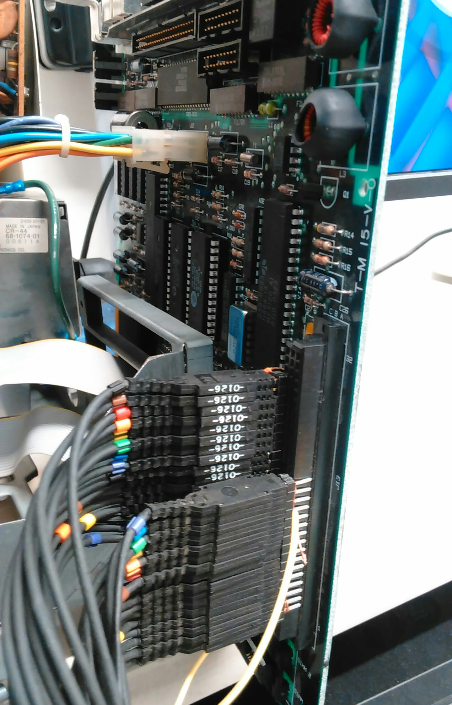

# Logic Analyzer on the PDS
As it turns out, the Macintosh SE has a Processor Direct Slot(PDS) which allowed developers to directly interface with external hardware. Since the Macintosh SE doesn't really have a kernel(just application calls that reside in the rom) or true virtual addressing, application developers would write drivers in assembly to query attached hardware directly. As on might imagine - such application could wreak much havok for the the end user.

I decided to take advantage of the processor direct slot by plugging in the Logic Analyzer at Digital Design Lab (DDL) directly into the PDS.

I first went to the DDL and wired up the Mac into the LA using this [pinout]. I then ran the LA software using the PDS clock as the acquisition edge. 



Unfortunately, I didn't take a picture of data capture on the LA's screen. But the CPU cycled through approximately the same 200 addresses repeatedly with B2E3 constantly showing up on the data bus. I read through the Mac SE hardware documentation on startup procedures, and my best guess is that reset pin keeps getting pulled active. The reset vector resides at virtual address 0x0000 which is later translated by the BBU to different physical address ```update this``` I stopped using the LA at DDL because of the difficulty and hassle. I built my own affordable LA described [here].

## PDS Pinout
| ROW | Column 1 | Column 2 | Column 3 |
|-----|----------|----------|----------|
| 32  | -12V     | -5V      | +12V     |
| 31  | Spare    | +12V     | +12V     |
| 30  | Ground   | +12V     | Ground   |
| 29  | D15      | Ground   | C16M     |
| 28  | D14      | Ext.STK/ | C8M      |
| 27  | D13      | Reserved | E        |
| 26  | D12      | Reserved | A23      |
| 25  | D11      | Reserved | A22      |
| 24  | D10      | Reserved | A21      |
| 23  | D9       | Reserved | A20      |
| 22  | D8       | Spare    | A19      |
| 21  | D7       | BERR/    | A18      |
| 20  | D6       | IPL2/    | A17      |
| 19  | D5       | IPL1/    | A16      |
| 18  | D4       | IPL0/    | A15      |
| 17  | D3       | +5V      | A14      |
| 16  | D2       | +5V      | A13      |
| 15  | D1       | +5V      | A12      |
| 14  | D0       | +5V      | A11      |
| 13  | +5V      | +5V      | A10      |
| 12  | RESET/   | HALT/    | A9       |
| 11  | PMCYC/   | Reserved | A8       |
| 10  | AS/      | Reserved | A7       |
| 9   | UDS/     | Ground   | A6       |
| 8   | LDS/     | Ground   | A5       |
| 7   | R/W/     | Ground   | A4       |
| 6   | DTACK/   | Ground   | A3       |
| 5   | BG/      | Ground   | A2       |
| 4   | BGACK/   | Ground   | A1       |
| 3   | BR/      | Ground   | FC0      |
| 2   | VMA/     | Ground   | FC1      |
| 1   | VPA/     | Ground   | FC2      |

[pinout]: #pds-pinout
[here]: why_an_fpga.md
