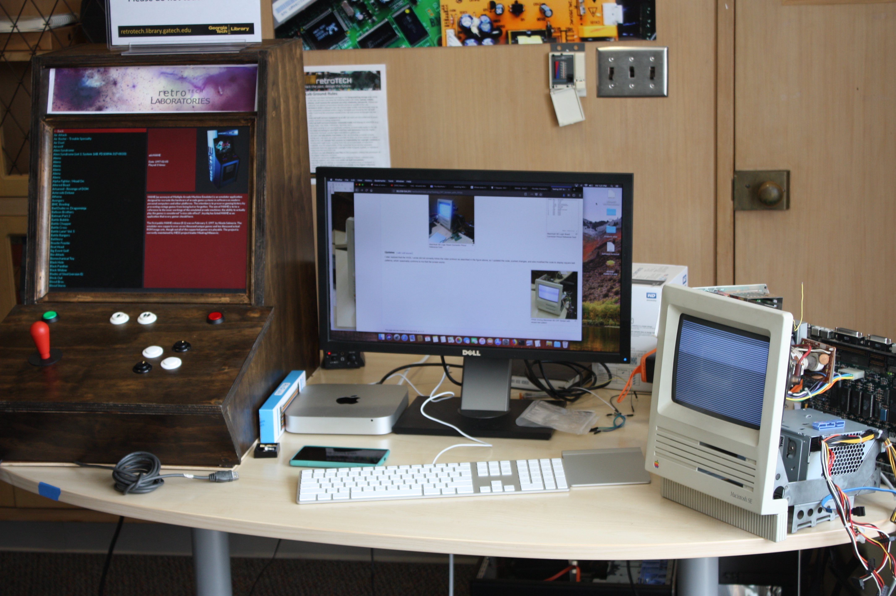

# My Setup | Old Work at Georgia Tech RetroTech Laboratories 
These particular research efforts have been made possible by RetroTech at the Georgia Tech Library - an organization committed to preserving old technology.

I currently write my software on a Mac Mini and Macbook (when I'm not near the Mac Mini)

I have various electronic devices such as  an FPGA (of course!), a mini UART cable (technically not FTDI - it's prolific tech.) some resistors, a soldering Iron, and some wires.

