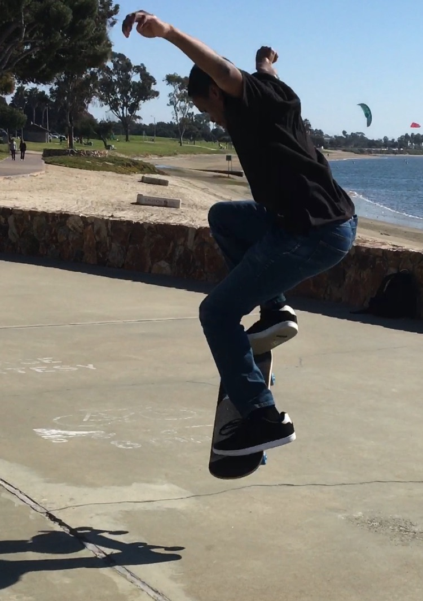

I am currently a master's student at Georgia Tech in Synergy Computer Hardware Systems Lab investigating discrete Convolutional Neural Networks accelerators.

I wrote my first program when I was seven or so and have been programming on and off ever since.

I am a Christian and an improving follower of Christ. I participate in various local ministries from time to time.

You can view my résumé [here].

---

<h2>Things that currently seem to consume my time</h2>
* Reverse Engineering FPGAs
* Porting Software to the venerable RISCV architecture
* Adding modern capabilities to really old computers (think 30yr old+)
* physics, electromagnetics, and mathematics
* skateboarding

[here]:https://github.com/BracketMaster/Resume/blob/master/CV.pdf

