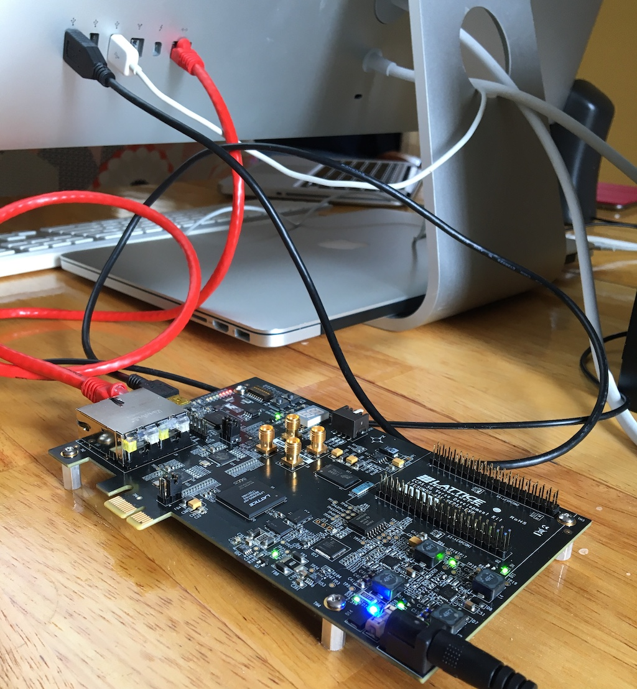
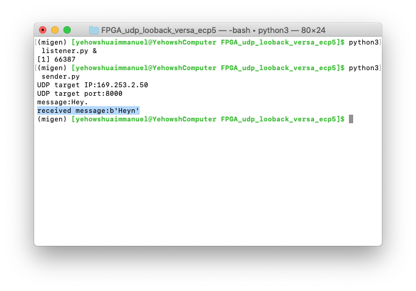
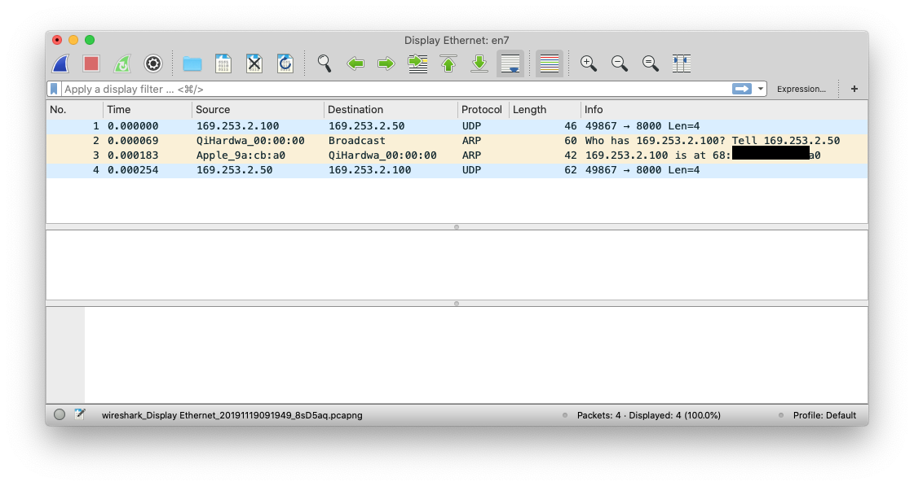

## Purpose

This tutorial is intended to help gently introduce the reader to using LiteX+Migen on supported FPGAs with a simple UDP
loopback over ethernet RJ45 example. 

A working understanding of Migen is required.

At the end of this tutorial, the FPGA will form a UDP loopback echoing back UDP messages to the sender IP
address and sender UDP port.

## Resources
Here are some resources for getting up to speed on Migen.

 - [Lambda Concepts Tutorial]
 - [Github Migen Practical Intro]
 - [Migen Manual]

## Code
First grab the code from [here].

    #!bash
	$./udp.py build
	#this programs the FPGA
	$./udp.py load

## Configuring the Ethernet
Your machine will obviously need to have an ethernet RJ45 jack. On my Mac, this usually means plugging in a Thunderbolt dongle.

### Connected to Internet via RJ45
If you're connected to the internet via your RJ45 ethernet, you'll either have to disconnect from internet or plug both your FPGA and PC into an external router.
The router approach is subtly more difficult as it will be necessary to manually configure the router's ARP table as this
example comes with no ARP hardware.

### Connected to Internet via Wi-Fi
It is also possible you may be connected to internet via Wi-Fi. If this is the case, run ``ifconfig`` and verify that the
most significant byte of the IP assigned to your ethernet interface differs from that assigned to your Wi-Fi interface.
In this example, the FPGA is programmed to respond to the IP of ``169.253.2.50``, so the ethernet interface from which the 
UDP packet destined for the FPGA originates must be on the same subnet. The IP address selected for the interface in this 
example is ``169.253.2.100``.

### Configuring the ARP table
Whether or not you are connected to the internet, you will have to modify your ARP table so that the kernel knows
where to route requests to the IP address of ``169.253.2.50``.
It is possible to add ARP support to the hardware via the LiteX Liteeth ARP module, but that is not included in this example, so it is necessary to manually modify the ARP table on your machine.

On my Mac, I am connected to internet via Wi-Fi while the FPGA is plugged into Thunderbolt RJ45 ethernet. The Thunderbolt
ethernet interface is listed as ``en7`` according to ``ifconfig``, so I set the IP and subnet of ``en7`` accordingly. The following command syntax works on BSD as well as Linux.

    #!bash
	$ifconfig en7 169.253.2.100 netmask 255.255.255.0

Next, I configure the ARP table where ``10:e2:d5:00:00:00`` is the MAC address of the FPGA.

#### FreeBSD/MacOS

    #!bash
	$arp -s 169.253.2.50 10:e2:d5:00:00:00 ifscope en7

#### Linux

    #!bash
	$arp -s 169.253.2.50 10:e2:d5:00:00:00 -iface en7

## Sending and Receiving Packets
You should now be able to send and receive UDP packets.

    #!bash
	$python3 listener.py &
	$python3 sender.py

If everything is working correctly, you should see ``recieved message:some message`` as the last line of output.

## Debugging

Wireshark is a good tool that should be in every engineer's toolbox.
Select the interface that you want to monitor in wireshark to help with debugging potential problems.
As you can see below, the FPGA receives the packet and then queries to determine the physical ethernet address the IP packet
originated from.

[Lambda Concepts Tutorial]:http://blog.lambdaconcept.com/doku.php?id=migen:tutorial
[Github Migen Practical Intro]:https://github.com/timvideos/litex-buildenv/wiki/LiteX-for-Hardware-Engineers#csrs-config-and-status-registers
[Migen Manual]:https://m-labs.hk/migen/manual/
[wireshark]:http://wireshark.org
[here]:https://github.com/enjoy-digital/liteeth/tree/master/examples/targets/udp_loopback
