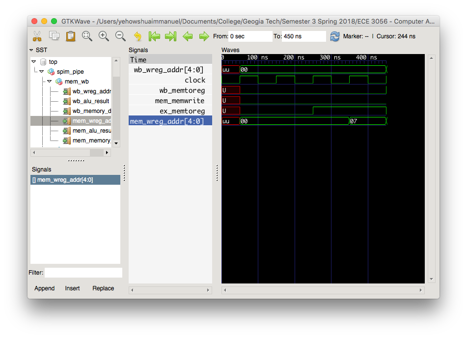
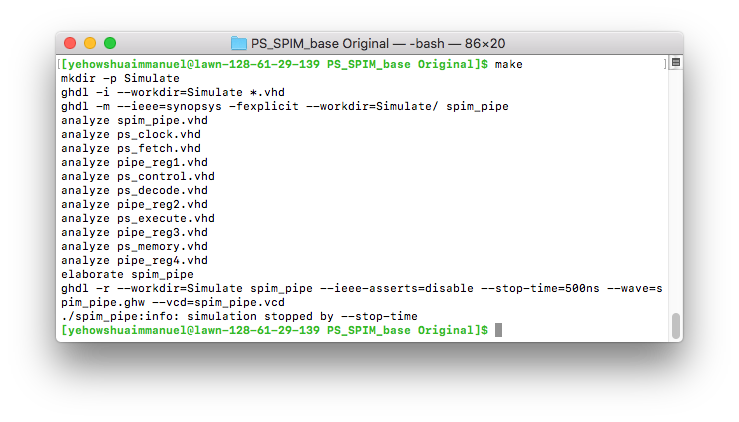

## Prologue
Unless you absolutely have to, generally, verilog is the 
preferred language by both hobbyists and those in industry alike.
More info on that [here](../hdl_wars.md).

This tutorial will teach you how to simulate a VHDL design I wrote that displays images
on a MacSE screen.
You will also be able verify the design works using a VHDL testbench, and preview the image
results in Python.

## First Steps

A Hardware Description Language(HDL) is purely that. It merely describes hardware.
There are a couple types of HDLs, digital and mixed(digital+analog). This tutorial deals with digital HDLs.

HDLs aren't very useful by themselves. Typically, they might be passed to a synthesizer
which reduces the HDL into a gate list with that describes all the connections between
various gates more commonly known as a netlist.

There are different kinds of synthesizers. Some synthesizer frameworks target FPGAs
while others target physical fabrication or VLSI. In VLSI, HDL is just the first step 
in a long laborious sequence of tasks.

After writing some HDL, you may wish to know whether or not it does what you want.
This can be accomplished using an HDL simulator. Currently, the only Free and Open
Source(FOSS) simulator being maintained is [GHDL].

## Installing GHDL

### Ubuntu
```bash
sudo apt update
sudo apt install build-essential gnat git llvm clang zlib1g-dev
mkdir -p ~/src; cd ~/src
git clone https://github.com/ghdl/ghdl
cd ghdl
mkdir build; cd build
../configure --with-llvm-config --prefix=/usr/local
make -j8
make install
```

### MacOS
```bash
mkdir -p ~/src; cd ~/src
wget https://github.com/ghdl/ghdl/releases/download/v0.36/ghdl-0.36-macosx-llvm.tgz
mkdir -p ghdl
tar -C ghdl -xf ghdl-0.36-macosx-llvm.tgz
rm ghdl-0.36-macosx-llvm.tgz
cd ghdl/bin
echo "export PATH=\"`pwd`:\$PATH\"" >> ~/.bash_profile
```



My workflow consists of this,
  - Invoke Make
  - Refresh Waveform in GTKWave

All this can be done in a quarter of a second for modest designs such as a pipeline CPU - also nice is that a properly written makefile only requires GHDL to re-evaluate changed components.

Here is the source on GitHub
https://github.com/BracketMaster/quick-ghdl-toolchain

## Simulating With GHDL 
You will probably want a makefile to automate your simulations. One is provided below.

Literally name your makefile "makefile". No extension necessary. This should be placed in the same directory that contains all the vhdl source.

	#!make
    TIME=500ns
    GHDL = ghdl
    GHDL_SIM_OPT = --stop-time=$(TIME)
    GHDL_FLAGS = --ieee=synopsys -fexplicit
    WORKDIR = Simulate
    TOP_ENTITY = spim_pipe
    echoPath = .bash_profile
    
    .PHONY : all compile run
    all : ./Simulate compile run
    
    ./Simulate :
    	mkdir -p $(WORKDIR)
    	$(GHDL) -i --workdir=$(WORKDIR) *.vhd
    
    compile :
    	$(GHDL) -m $(GHDL_FLAGS) --workdir=$(WORKDIR)/ $(TOP_ENTITY)
    
    run :
    	$(GHDL) -r --workdir=$(WORKDIR) $(TOP_ENTITY) --ieee-asserts=disable --stop-time=$(TIME) --wave=$(TOP_ENTITY).ghw --vcd=$(TOP_ENTITY).vcd
    
    clean :
    	rm -rf Simulate
    	rm -f $(TOP_ENTITY).ghw
    	rm -f $(TOP_ENTITY).vcd
    	rm -f e~$(TOP_ENTITY).o
    
    install-OSX :
    	tar -xzvf ./gtkwave.app.tar
    	sudo cp -rf ./gtkwave.app /Applications/
    	mkdir -p ~/sources
    	tar -xzvf ./GHDL.tar
    	cp -rf ./GHDL ~/sources
    	printf "export PATH=\"$$(echo ~)/sources/GHDL/bin/:\$${PATH}\"\n" >> ~/$(echoPath)
    	source ~/.bash_profile
    
    test :
    	printf "export PATH=\"$$(echo ~)/sources/GHDL/bin/:\$${PATH}\"\n" >> ~/$(echoPath)


Software like Modelsim gives you the option to force a signal high and low as a clock and to hold the reset at the beginning of the simulation. Providing inputs to your HDL model is called a testbench. You may need to write a testbench for your code, if one hasn't been provided already.

To determine whether or not your codeset may already have a testbench, you can perform a recursive search over all your vhdl files in the terminal for the ''after'' vhdl keyword which is usually only included is tesbenches because it instructs the simulator to toggle the input after a certain amount of time.

  * Change into the directory containing the vhdl source
  * ''grep -R "after" ./''

You should see some results perhaps like this.

```
[macbookPro PS_SPIM_base Original]$ grep -R "after" ./ 
.//ps_clock.vhd:          sys_clock <= '0', '1' after 50 ns;
.//ps_clock.vhd:reset <= '1', '0' after 75 ns;
Binary file .//spim_pipe matches
```

In this case, the file ''ps_clock.vhd'' is the testbench.

If you are missing a testbench, an example testbench is provided below.

	#!verilog
    LIBRARY IEEE;
    USE IEEE.STD_LOGIC_1164.ALL;
    USE IEEE.STD_LOGIC_ARITH.ALL;
    USE IEEE.STD_LOGIC_UNSIGNED.ALL;
    use std.textio.all;
    
    entity my_clock is
    port ( signal sys_clock, reset : out std_logic);
    end entity my_clock;
    
    architecture behavior of my_clock is 
    begin
        process
            begin
            -- generate clock
              sys_clock <= '0', '1' after 50 ns;
              wait for 100 ns;
             end process; 
             -- following statement executes only once
    reset <= '1', '0' after 75 ns;
    end architecture behavior;

Finally change into the directory of your makefile and in the terminal and type ''make''.
You might see something like this once GDHL compiles for the first time


