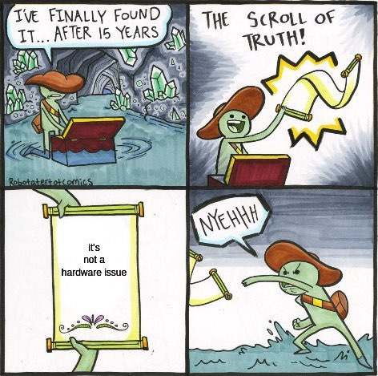
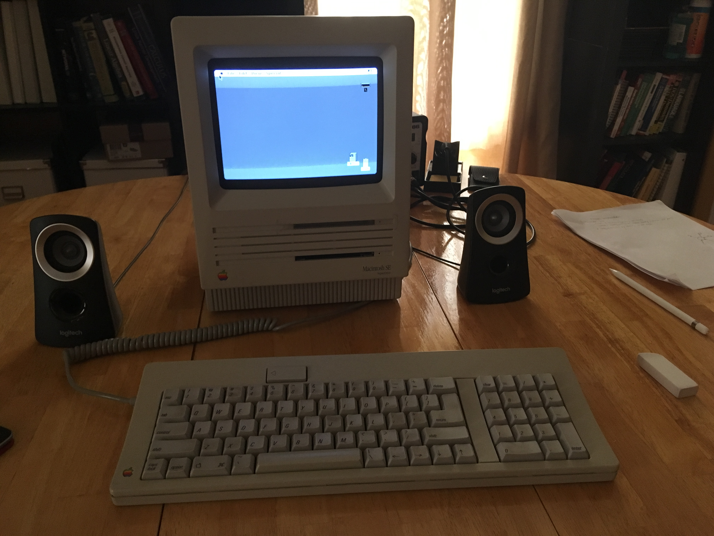

# Welcome to Planet Program

I wonder if I would say I'm primarily a programmer. I wrote my first program when I was seven and have been programming on and off ever since. That said, software is very important to what I do, but at the end of the day, its still a tool that makes other activities I enjoy that much easier. 

Some incarnation of this website began when I was an undergrad mainly to help me keep track of projects I did in the past such as [reverse enginneering the MacSE 1987]. It still serves that function; hence its current name. But it finds other uses such as helping document interesting artifacts of programmer culture. Enjoy!

## Recent Phenonmena
### verilator backend for nMigen
I have been working on adding a verilator backend to nMigen-HDL Pythonthat is almost ready.
More information on that effort [here].

nMigen is a high level HDL quite similar to [Chisel] but width the advantages of:

1. No simulator boilerplate and easy support for multiple clock domains
2. Implmented in Python. This means no slow SBT compile times or doing the SBT package manager dance. Pip just works.
3. I also find Python idiosms much more simple/useful/natural than Scala's

I offer a more in depth comparison of various HDLs and their problems
[here](fpga/hdl_wars.md).

### recent new-old tech acquisition
One of my youth pastors/mentors recently gave me his MacSE 1987!
I started writing some drivers and designing an FPGA based graphics card for the MacSE.
This is much harder than I originally thought.

[reverse enginneering the MacSE 1987]: Vintage_Tech/retrotech/my_setup.md
[here]: fpga/verilator/dpi.md
[Chisel]: https://www.chisel-lang.org
