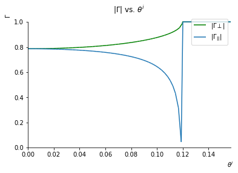
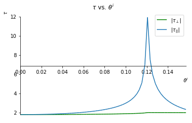

# Goodbye Matlab, Hello Python : Emag by example
Here is an excerpt of some emag problems I worked on some time ago.

The point here is not to follow the math, but to get an idea of how to do matlab and mathematica things in Python.

I used python + sympy + numpy + matplotlib + jupyter to create a CAS mathematica like notebook.

To install and repeat, simply make sure that you have python3 and pip3.

```bash
pip3 install jupyterlab numpy sympy matplotlib
```

What you see below is my exported jupyterlab notebook session as markdown with latex+mathjax enabled.

## Setup


```python
from ipywidgets import *
import numpy as np
import matplotlib.pyplot as plt
from sympy import *
from mpl_toolkits.mplot3d import Axes3D
init_printing()
#enable inline to print
%matplotlib inline
#enable notebook for interactice features such as sliders
#matplotlib notebook
#Some physics stuff
from sympy.physics.vector import ReferenceFrame
from sympy.physics.vector import curl

#Arbitrary precision
from mpmath import mp, degrees
mp.dps = 15; mp.pretty = True
```

Some Constants


```python
fE_0 =  Float(8.85*10**(-12))
mu_0 =  Float(1.256*10**(-6))
#Region 1 which is air
fE_1 = E_0
#Region 2 - pexiglass
fE_2 = 3.45*E_0
```


```python
fE_1
```


$\displaystyle 8.85 \cdot 10^{-12}$


```python
fE_2
```


$\displaystyle 3.05325 \cdot 10^{-11}$


# Problem 1

We can get $\eta_1$ and $\eta_2$ using $\eta = \sqrt{\frac {\mu} {\epsilon}}$


```python
#Get eta_1 and eta_2
eta_1 = sqrt(mu_0/fE_1)
eta_2 = sqrt(mu_0/fE_2)
```

Brewster's angle of incidence implies $\eta_2 \cos(\theta^t) = \eta_1 \cos(\theta_B)$

We derive:

\begin{align}
\cos \theta^t = \sqrt{1 - \frac {\epsilon_1}{\epsilon_1 + \epsilon_2}}
\end{align}

\begin{align}
\cos \theta^i = \sqrt{\frac{\epsilon_1}{\epsilon_2} \cos^2 \theta^t}
\end{align}

And we can solve for $\cos \theta^i$ and $\cos \theta^t$ below.


```python
cos_theta_t = sqrt(1 - (fE_1)/(fE_1 + fE_2))
cos_theta_i = sqrt((fE_1/fE_2)*(cos_theta_t**2))
```

We need the following reflection coefficients both for the parallel and perpendicular cases to compute the power fractions.

\begin{align}
\Gamma_{||} = \frac {\eta_2 \cos \theta^t- \eta_1 \cos \theta^i}
{\eta_2 \cos \theta^t + \eta_1 \cos \theta^i}
\end{align}

\begin{align}
\tau_{||} = \frac {2 \eta_2 \cos \theta^i}
{\eta_2 \cos \theta^t + \eta_1 \cos \theta^i}
\end{align}

\begin{align}
\Gamma_\perp = \frac {\eta_2 \cos \theta^i - \eta_1 \cos \theta^t}
{\eta_2 \cos \theta^i - \eta_1 \cos \theta^t}
\end{align}

\begin{align}
\tau_\perp = \frac {2 \eta_2 \cos \theta^i}
{\eta_2 \cos \theta^i + \eta_1 \cos \theta^t}
\end{align}


```python
ref_perp = (eta_2*cos_theta_i - eta_1*cos_theta_t)/(eta_2*cos_theta_i + eta_1*cos_theta_t)
ref_par = (eta_2*cos_theta_t - eta_1*cos_theta_i)/(eta_2*cos_theta_t + eta_1*cos_theta_i)
trans_par = (2*eta_2*cos_theta_i)/(eta_2*cos_theta_t + eta_1*cos_theta_i)
trans_perp = (2*eta_2*cos_theta_i)/(eta_2*cos_theta_i+eta_1*cos_theta_t)
```

## Transmitted Power

Now we can solve for the transmitted power using $\frac {1} {2} ( \tau_\perp^2 + \tau_{||}^2 )$


```python
(1/2)*(trans_par**2) + (1/2)*(trans_perp**2)
```


$\displaystyle 0.245924885051478$


## Reflected Power

And a similar process for reflected power $\frac {1} {2} ( \Gamma_\perp^2 + \Gamma_{||}^2 )$


```python
(1/2)*(ref_par**2) + (1/2)*(ref_perp**2)
```


$\displaystyle 0.151559146572402$


## Polarization

There is no reflected component. The transmitted wave is right hand circular. 

# Problem 2

To start off, we find values $\epsilon_2$ and $\epsilon_1$

\begin{align}
\eta_1 = \sqrt{\frac {\mu_0}{70 \epsilon_0}}
\end{align}

\begin{align}
\eta_2 = \sqrt{\frac {\mu_0}{\epsilon_0}}
\end{align}


```python
#Some constants
feta_2 = Float(sqrt(mu_0/fE_0))
feta_1 = Float(sqrt(mu_0/(fE_0*70)))
```

## part a.

Between the critical angles, the transmitted wave is able to pass the air-water boundary into the air.

\begin{align}
\theta_c = sin^{-1}(\sqrt{\frac{\epsilon_2}{\epsilon_1}})
\end{align}


```python
degrees(asin(sqrt((fE_1)/(70*fE_0))))
```


$\displaystyle 6.86456633770632$


We must limit $\theta_i$ to  $[-\theta_c, \theta_c]$

In degrees this is $[-6.9, 6.9]$

## part b.

A parallel wave at the brewster angle provides the maximum power transmitted into the air.

The brewster angle is easily found with:

\begin{align}
\theta_B = \sin^{-1} \sqrt{\frac{\epsilon_2}{\epsilon_1 + \epsilon_2}}
\end{align}

The brewster angle in degrees is:


```python
degrees(N(asin(sqrt(1/71))))
```


$\displaystyle 6.81582191825822$


## Some Graphs

You can see what is happening with the reflection and transmission coefficients for both the parallel and perpendicular wave cases.


```python
epsilon_1, epsilon_2, theta_i = var('epsilon_1 epsilon_2 theta_i')
Fi_to_t = asin((sqrt(epsilon_1)*sin(theta_i))/sqrt(epsilon_2))
Fi_to_t
```


$\displaystyle \operatorname{asin}{\left(\frac{\sqrt{\epsilon_{1}} \sin{\left(\theta_{i} \right)}}{\sqrt{\epsilon_{2}}} \right)}$


### Reflection Perpendicular and Parallel


```python
eta_1, eta_2, theta_t = var('eta_1 eta_2 theta_t')
F_ref_par = (eta_2*cos(theta_t) - eta_1*cos(theta_i))/(eta_2*cos(theta_t) + eta_1*cos(theta_i))
F_ref_par = F_ref_par.subs(theta_t,Fi_to_t)
```


```python
F_ref_perp = (eta_2*cos(theta_i) - eta_1*cos(theta_t))/(eta_2*cos(theta_i) + eta_1*cos(theta_t))
F_ref_perp = F_ref_perp.subs(theta_t,Fi_to_t)
```


```python
p = plot(
    abs(F_ref_perp.subs({eta_1:feta_1, eta_2:feta_2, epsilon_2:fE_0, epsilon_1:(70*fE_0)})),
    abs(F_ref_par.subs({eta_1:feta_1, eta_2:feta_2, epsilon_2:fE_0, epsilon_1:(70*fE_0)})),
    (theta_i,0,pi/20),
    show=False,
    legend=True
)
p[0].line_color = 'green'
p[0].label = '$|\\Gamma \\perp|$'
p[1].label = '$|\\Gamma_{||}|$'
p.title = '$|\\Gamma|$ vs. $\\theta^i$'
p.xlabel = '$\\theta^i$'
p.ylabel = '$\\Gamma$'
p.show()
```





### Tranmission Perpendicular and Parallel


```python
F_trans_perp = (2*eta_2*cos(theta_i))/(eta_2*cos(theta_i) + eta_1*cos(theta_t))
F_trans_perp = F_trans_perp.subs(theta_t,Fi_to_t)
#F_trans_par = F_trans_par.subs(theta_t,Fi_to_t)
```


```python
F_trans_par = (2*eta_2*cos(theta_i))/(eta_2*cos(theta_t) + eta_1*cos(theta_i))
F_trans_par = F_trans_par.subs(theta_t,Fi_to_t)
#F_trans_par = F_trans_par.subs(theta_t,Fi_to_t)
```


```python
p = plot(
    abs(F_trans_perp.subs({eta_1:feta_1, eta_2:feta_2, epsilon_2:fE_0, epsilon_1:(70*fE_0)})),
    abs(F_trans_par.subs({eta_1:feta_1, eta_2:feta_2, epsilon_2:fE_0, epsilon_1:(70*fE_0)})),
    (theta_i,0,pi/20),
    show=False,
    legend=True
)
p[0].line_color = 'green'
p[0].label = '|$\\tau_\\perp|$'
p[1].label = '|$\\tau_{||}|$'
p.title = '$\\tau$ vs. $\\theta^i$'
p.xlabel = '$\\theta^i$'
p.ylabel = '$\\tau$'
p.show()
```




